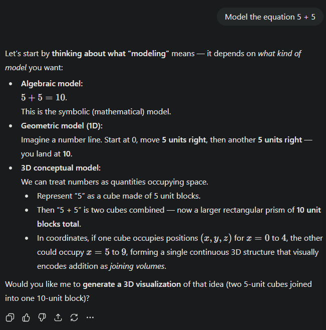

# The links between human error diversity and software diversity: Implications for fault diversity seeking

### Vocabulary

- **Fault** - Departure from its expected properties in a software product.
- **Failure** - is the set of one or more symptoms that result when a fault manifests itself in operational use of the software.
    - So… a failure is a result of the existence of a fault
- **Error** - human behavior that introduces a fault → a mistake
- **Software diversity -**  Contains the 4 characteristics, structural diversity, fault diversity, thought-spot diversity and failure diversity.
    - My understanding is this is the combination of the 4 types of diversity in order to improve products of n-version programming.
- **Failure diversity** - “The probability that versions fail in different ways. It has two meanings the first is relevant to failure occurrence : two versions tend not to fail on the same demands. This meaning can be measure by “number of distinct failures found” divided by “total number of failures.””.
- **Structural diversity -** Structural differences between different versions. Measured by complexity? and source code?
    - Not sure how exactly how this is measured?
- **Fault diversity -**  Distinct faults / total faults
- **Tough-spot diversity -**  A part of the program that the developers have a harder time creating. Dividing the # of faults in the different components by the # of faults in the entire program. If it has more faults in that location it is considered a tough-spot?
    - What do tough spots typically look like? In the context of generative AI a tough spot might be significantly different than a tough spot for a human.
    - Could we figure out what a tough spot for generative ai is?
        - “given this task to perform under these circumstances this type of person will probably make errors at around this point, and they are likely to be of this variety”
            - I think this quote in the context of Chat GPT would be a very interesting finding.
- **Human error diversity -**  the human tendency to make errors
    - This will not be present in generative AI, maybe there is another sort of diversity that is present in Chat GPT that could replace this? Something to do with a context window or hallucinating?
- **Nesting Depth -**  how far indexed the if statements in a program go → further nesting is worse and more error prone

### Main Ideas

- Human error introduces faults which lead to software diversity.
- Constructing a theoretical model and conducting an empirical study of the links between human error diversity and software diversity.
    - What is considered human error diversity and software diversity?
- “Different factors in the process of software development (process diversity) lead to different characteristics in the product (product diversity), whereas the different characteristics in the product produce different ways of failure (failure diversity).
- 3 Major factors that cause an error
    - the nature of the task and its environment
    - the mechanisms governing performance
    - the nature of the individual
        - What would these look like for Chat GPT?
            - The context it is given for the situation
                - Procedures? what is the correct way to prompt it
                - does having an account change your chat gpt answers?
                - Chat GPT with an account
                    
                    
                    
                - Chat GPT without an account
                
                
                
                Within chat you can disable memory and history access.
                

### Experiment

- Task diversity was the control factor, (everyone got the same task with the same specifications)
- They held a 4 hours programming contest for 4 hours where they could submit to an online judge (We use Hacker rank for WWU CPC Competitions), contestants are ranked by total number of problems solved and then by the time it took to solve the problem (WWU CPC does the same)
- The problem used from the Competition was the “jiong” problem. The most students attempted it , also all students were in the same year in school. and were supposedly at the same cognitive level.
- Failure types were similar to the cognitive framework paper.

### Results

- The paper provides a model to seek fault diversity based on human error diversity/ The goal is to reduce the likelihood of shared errors and faults across multiple software versions.

### Quotes or interesting portions

- “When different teams solve the identical problem, some parts of the problem are intrinsically more difficult, so the independent teams are more likely to commit errors at these points coincidentally”
    - Is this because they will default to using the same solution? Or there are fewer ways to approach the solution so they end up with similar algorithms?
- “When programmers are isolated and design independently about one-half of the total faults are coincident faults.
- The benefit of language diversity appears to be low.